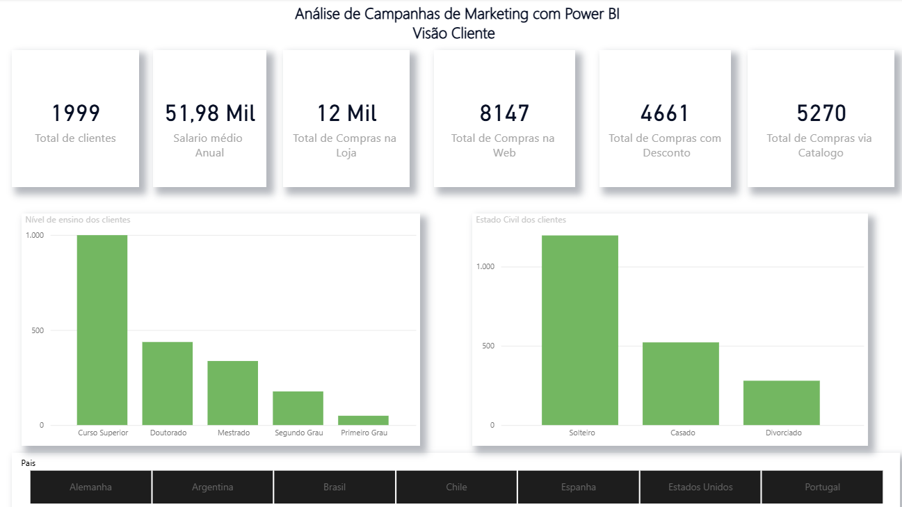
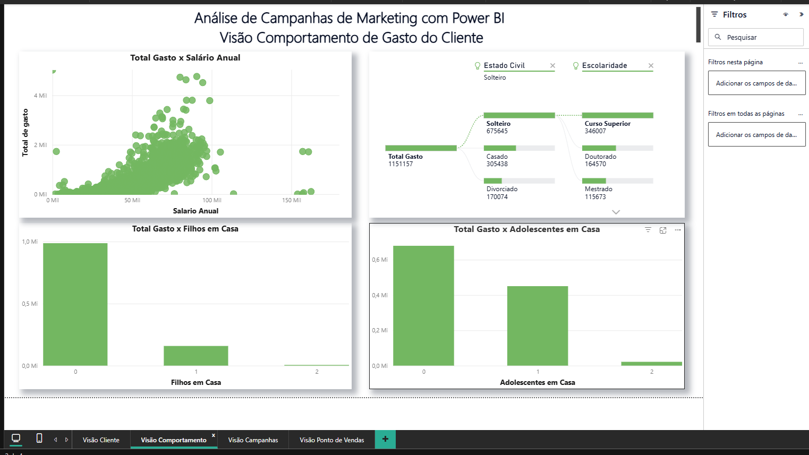
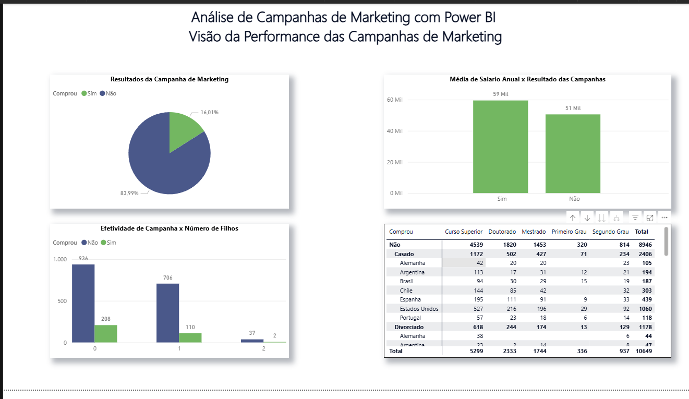
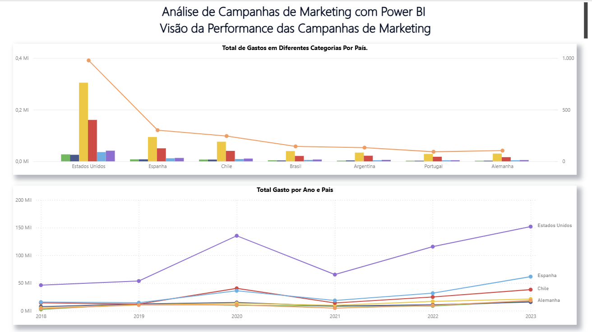

# 📊 Análise de Campanhas de Marketing com Power BI

Este projeto apresenta uma análise de campanhas de marketing utilizando o Power BI. O objetivo é explorar dados customizados sobre clientes e campanhas realizadas por uma empresa, aplicando técnicas de modelagem, visualização e análise de indicadores.

---

## 🎯 Objetivo

Entregar aos tomadores de decisão uma visão clara e estratégica sobre:

- O perfil dos clientes
- Comportamentos de compra
- Efetividade das campanhas de marketing
- Padrões de consumo por país

---

## 🧠 O que foi desenvolvido

- ✅ 4 Dashboards interativos
- ✅ Mais de 10 elementos visuais
- ✅ Medidas DAX personalizadas
- ✅ Correções e tratamento de dados
- ✅ Customizações e formatações avançadas

---

## 🗂️ Visões do Projeto

### 1. **Visão do Cliente**
Análise demográfica e comportamental dos clientes:
- Total de clientes
- Média de gasto anual
- Compras por canal (loja, web, catálogo, desconto)
- Escolaridade e estado civil

### 2. **Visão do Comportamento de Compra**
Relação entre gasto total e variáveis familiares:
- Salário anual vs. gasto
- Filhos e adolescentes em casa
- Escolaridade e estado civil cruzados com consumo

### 3. **Visão da Performance das Campanhas**
Efetividade das campanhas de marketing:
- Taxa de resposta (Sim vs. Não)
- Salário médio por resposta
- Impacto por número de filhos
- Tabela detalhada por país

### 4. **Visão dos Padrões de Compra no Ponto de Venda**
Análise de gastos por país e ao longo dos anos:
- Gastos por categoria e país
- Evolução anual de investimentos em campanhas

---

## 📷 Dashboards

---

## 📁 Arquivos do Repositório

- `Dashboard/` — Arquivo principal do projeto no Power BI
- `README.md` — Documentação do projeto
- `Imagens/` — Imagens dos dashboards
- `Data/` — Dados do projeto

---

## 📌 Requisitos

Para visualizar o projeto completo, é necessário ter o **Power BI Desktop** instalado.

---

## 📬 Contato

Projeto desenvolvido por **Guilherme de Queiroz**  
📧 dequeirozguilherme1899@gmail.com  
🔗 [Portfólio no GitHub](https://github.com/dequeirozguilherme1989-tech)

---

> Este projeto é parte do conteúdo prático da Data Science Academy e tem como objetivo aplicar conceitos de análise de dados em um cenário de marketing realista.
